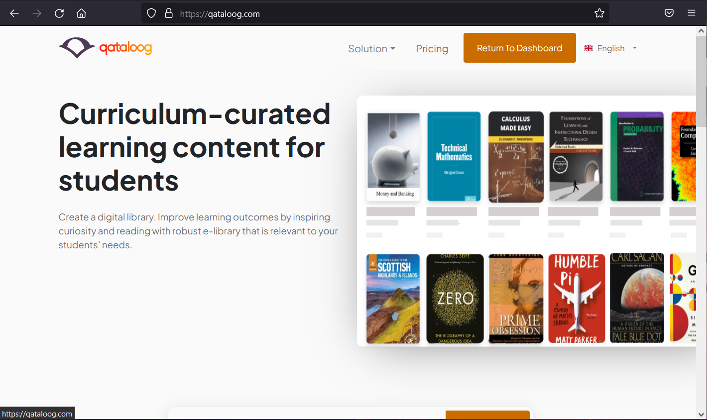
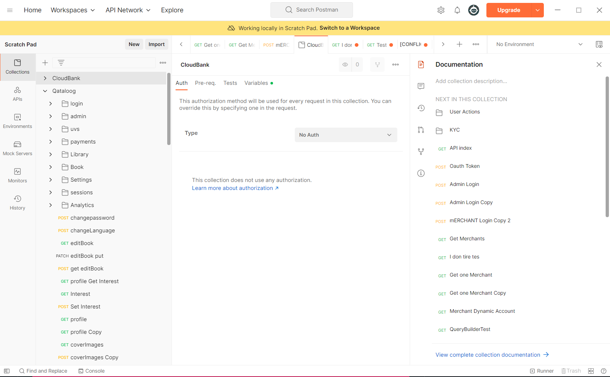

# portfolio

## Project1

 web application that I worked on from 2019. It is an Edtech Platform that specialize the distribution of Learning Content. 
 Qataloog is currently built with Laravel API Backend and React Frontend and it is hosted on AWS.

 The APIs are documented using postman. Here is a sample of my postman scratchpad

 

You can check it out at [Qataloog](https://qataloog).