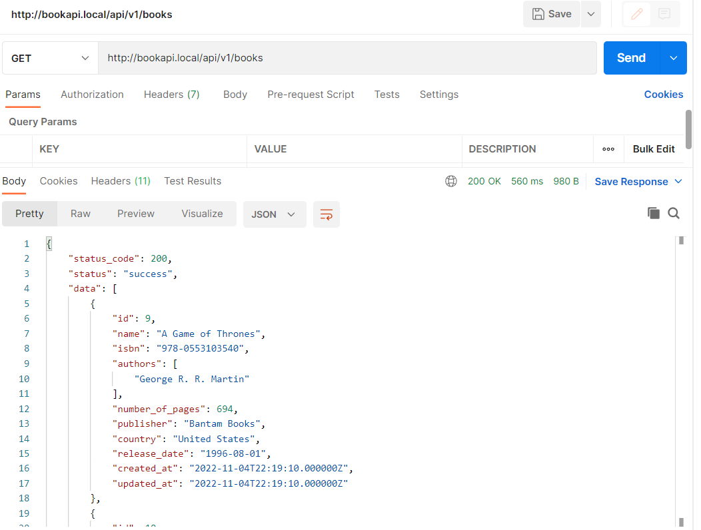

# portfolio

## Project1: Book API

Book API is a Laravel Project built with TTD concepts. 

This API calls an external API service which is the Ice And Fire API to get information about books and also implements its own database and has basic CRUD functions. It also includes the feature tests.

 The APIs are documented using postman. Here is a sample of my postman scratchpad

Project code available on [Githup Link](https://github.com/kayxleem/books-api).